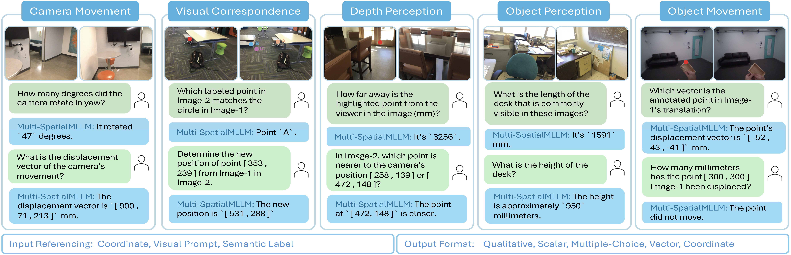

<p align="center">
<h1 align="center"><strong>Multi-SpatialMLLM: Multi-Frame Spatial Understanding with Multi-Modal Large Language Models</strong></h1>
  <p align="center">
    <a href='https://runsenxu.com/' target='_blank'>Runsen Xu</a>&emsp;
    <a href='https://sites.google.com/view/weiyaowang/home' target='_blank'>Weiyao Wang</a>&emsp;
    <a href='https://scholar.google.com/citations?hl=en&user=XY6Nh9YAAAAJ' target='_blank'>Hao Tang</a>&emsp;
    <a href='https://scholar.google.com/citations?user=gjSHr6YAAAAJ' target='_blank'>Xingyu Chen</a>&emsp;
    <a href='https://scholar.google.com/citations?user=rMpcFYgAAAAJ' target='_blank'>Xiaodong Wang</a>&emsp;
    <a href='https://fujenchu.github.io/' target='_blank'>Fu-Jen Chu</a>&emsp;
    <br>
    <a href='http://dahua.site/' target='_blank'>Dahua Lin</a>&emsp;
    <a href='https://www.linkedin.com/in/matt-feiszli-76b34b/' target='_blank'>Matt Feiszli</a>&emsp;
    <a href='https://kevinjliang.github.io/' target='_blank'>Kevin J. Liang</a>&emsp;
    <br>
    FAIR, Meta&emsp;The Chinese University of Hong Kong&emsp;
  </p>
</p>

<p align="center">
  <a href="https://arxiv.org/pdf/2505.17015" target='_blank'>
    
  </a> 
  <a href="https://arxiv.org/abs/2505.17015" target='_blank'>
    
  </a> 
  <a href="https://runsenxu.com/projects/Multi-SpatialMLLM/" target='_blank'>
    
  </a>
  <a href="" target='_blank'>
    
  </a>
</p>

## 🏠 About
<!--  -->
<div style="text-align: center;">
    
</div>
We present <strong>Multi-SpatialMLLM</strong> to equip MLLMs with robust multi-frame spatial understanding by integrating <strong>depth perception, visual correspondence, and dynamic perception</strong>. Central to our approach is the <strong>MultiSPA dataset</strong>, a novel, large-scale collection of more than 27 million samples spanning diverse 3D and 4D scenes. Alongside MultiSPA, we introduce a comprehensive <strong>benchmark</strong> that tests a wide spectrum of spatial tasks under uniform metrics. Our model achieves significant gains over baselines and proprietary systems, demonstrating <strong>scalable</strong>, <strong>generalizable</strong> multi-frame reasoning. We further observe <strong>multi-task benefits</strong> and early indications of <strong>emergent capabilities</strong> in challenging scenarios, and showcase our model can serve as a <strong>multi-frame reward annotator for robotics</strong>.


## 🔥 News
- [2025-05-22] We release the [paper](https://arxiv.org/abs/2505.17015) of Multi-SpatialMLLM and the codes of our data engine. &#x1F389;

## 📋 Contents
- [📦 Data Engine](#-data-engine)
- [🏋️‍♂️ Model Training](#-model-training)
- [🔗 Citation](#-citation)
- [📄 License](#-license)
- [👥 Contributing](#-contributing)

## Data Engine
### Environment
To set up the Conda environment for this our data engine, please follow these steps:

1.  Ensure you have [Anaconda](https://www.anaconda.com/products/distribution) or [Miniconda](https://docs.conda.io/en/latest/miniconda.html) installed.
2.  Clone this repository.
    ```bash
    git clone https://github.com/facebookresearch/Multi-SpatialMLLM.git
    cd Multi-SpatialMLLM
    ```
3.  Create the Conda environment using the provided YAML file:
    ```bash
    conda env create -f requirements/data_engine.yaml
    ```
4.  Activate the newly created environment:
    ```bash
    conda activate data_engine
    ```

### Data Preparation
#### ScanNet
Please follow [spatial_engine/utils/scannet_utils/README.md](spatial_engine/utils/scannet_utils/README.md) to download and process the ScanNet data.

#### TAPVid-3D
Follow [TAPVid-3D](https://github.com/google-deepmind/tapnet/tree/main/tapnet/tapvid3d) to download the data. We only use the ADT and PStudio subsets. You need to download the version with camera extrinsics annotation according to [this](https://github.com/google-deepmind/tapnet/issues/115).
  <details>
  <summary>Here are some notes for your reference, but simply following the official script is enough.</summary>

  - Change the download url in `tapnet/tapnet/tapvid3d/annotation_generation/gcs_utils.py` from `https://storage.googleapis.com/dm-tapnet/tapvid3d/release_files/rc4` to `"https://storage.googleapis.com/dm-tapnet/tapvid3d/release_files/rc5"`. Also, modify `tapnet/tapnet/tapvid3d/annotation_generation/adt_utils.py` to store the extrinsics_w2c in the npz file like below.
    ```python
        # also add this for warning
        sequence_path = os.path.join(input_adt_path, adt_v2_name)
        # if the sequence_path is not exist, write to an warning file and exit
        if not os.path.exists(sequence_path):
            with open(f"adt_warning.txt", "a") as f:
            f.write(f"Sequence {seq_name} does not exist.")
            return
        ...
        ...

        queries_xyt = in_npz["queries_xyt"]
        trajectories = in_npz["tracks_XYZ"]
        visibilities = in_npz["visibility"]
        extrinsics_w2c = in_npz["extrinsics_w2c"] # add this

        # Verify video means.
        video_means = np.stack([np.mean(x, axis=(0, 1)) for x in rgb_ims], axis=0)
        assert np.allclose(video_means, in_npz["video_means"], atol=1e-3)

        example = {
            "images_jpeg_bytes": rgb_jpegs,
            "queries_xyt": queries_xyt,
            "tracks_XYZ": trajectories,
            "visibility": visibilities,
            "fx_fy_cx_cy": np.array(
                [FOCAL_LENGTH, FOCAL_LENGTH, WIDTH / 2, HEIGHT / 2]
            ),
            "extrinsics_w2c": extrinsics_w2c # add this
        }
    ```
  - Each npz file from TAPVid-3D contains the following keys:
    ```python
      """
      Each *.npz file, contains:

      images_jpeg_bytes: tensor of shape [# of frames, height, width, 3], each frame stored as JPEG bytes that must be decoded
      intrinsics: (fx, fy, cx, cy) camera intrinsics of the video
      tracks_xyz: tensor of shape (# of frames, # of point tracks, 3), representing the 3D point trajectories and the last dimension is the (x, y, z) point position in meters. They are in camera coordiate. They are in camera coordiates.
      visibility: tensor of shape (# of frames, # of point tracks), representing the visibility of each point along its trajectory
      queries_xyt: tensor of shape (# of point tracks, 3), representing the query point used in the benchmark as the initial given point to track. The last dimension is given in (x, y, t), where x,y is the pixel location of the query point and t is the query frame.
      extrinsics_w2c: tensor of shape (#, 4, 4)
      """
    ```
  - For Pstudio, after running the official script, you will have a `tmp` folder inside, which is used to store the original video (image) from the pstudio dataset. You can just omit this folder.
  - For ADT
      - Need to download the original files from the Project Aria website and place the data in `data/projectaria_tools_adt_data`. 
          ```
          pip install projectaria-tools'[all]'

          # get a adt_download_urls.json from the official website
          mkdir data/projectaria_tools_adt_data
          mv adt_download_urls.json data/projectaria_tools_adt_data

          # download the data with all the types, it costs 1.4 T in total.
          aria_dataset_downloader -c data/projectaria_tools_adt_data/adt_download_urls.json -o data/projectaria_tools_adt_data/ -l all 
          ```
      - Then run the official script to download the query points and postprocess them to store image info inside the npz file.
          ```
          cd tapnet
          ADT_OUTPUT_DIRECTORY="tapvid3d_dataset/adt/"\nmkdir -p $ADT_OUTPUT_DIRECTORY
          PYTHON_DEBUG="False"
          conda activate projectaria # if applicabe, use a new env
          python3 -m tapnet.tapvid3d.annotation_generation.generate_adt --output_dir=$ADT_OUTPUT_DIRECTORY --debug=$PYTHON_DEBUG --split=all --adt_base_path data/projectaria_tools_adt_data
          ```
          Specifically, in `tapnet/tapnet/tapvid3d/annotation_generation/generate_adt.py`:
          ```
          gcs_utils.download_tapvid3d_files(tmp_adt_dir, _SPLIT.value, "adt", _DEBUG.value)
          ```
          this function will download the npz files from the given url to `tmp` (which costs about 11G) and the following function will merge the images/videos from `adt_base_path` to the npz file.
          ```
          generate_adt_npz(_ADT_BASE_PATH.value, tmp_adt_dir, _OUTPUT_DIR.value)
          ```

  </details>

Finally, we assume the structure of the data is like:
  ```bash
  data/tapvid3d_dataset
  ├── adt
  │   ├── "scene_id".npz
  ├── pstudio
  │   ├── "scene_id".npz
  ```

### Data Generation
We generate the data based on the conversation format of [InternVL](https://internvl.readthedocs.io/en/latest/get_started/chat_data_format.html#multi-image-data), you could easily change the generated jsonl file to the format of your own.
#### Camera Movement
1. Run `python spatial_engine/camera_movement/calculate_frames_relations.py` to calculate the spatial relations between frames, e.g. their overlap ratios. After running this script, a parquet containing these spatial information will be generated in `training_data/camera_movement` and `evaluation_data/camera_movement`.

2. Then run `python spatial_engine/camera_movement/camera_movement_engine_train_val.py` to generate the training and evaluation data.

#### Depth Perception
1. Run `python spatial_engine/utils/scannet_utils/make_visibility_info.py` to compute the visibility information for each frame. Note that when using this information, loading the file takes a long time, about several minutes.
2. Run `python spatial_engine/depth_perception/depth_estimation_dot_engine.py` to generate the training and evaluation data for visual-based depth estimation.
3. Run `python spatial_engine/depth_perception/depth_estimation_coor_engine.py` to generate the training and evaluation data for coordinate-based depth estimation.
4. Run `python spatial_engine/depth_perception/depth_comparison_dot_engine.py` to generate the training and evaluation data for visual-based depth comparison.
5. Run `python spatial_engine/depth_perception/depth_comparison_coor_engine.py` to generate the training and evaluation data for coordinate-based depth comparison.

#### Visual Correspondence
1. Run `python spatial_engine/visual_correspondence/visual_correspondence_qa_engine_dot_2_multichoice.py` to generate the training and evaluation data for visual correspondence in dot-based multichoice format.
2. Run `python spatial_engine/visual_correspondence/visual_correspondence_qa_engine_coor_2_coor.py` to generate the training and evaluation data for visual correspondence in coordinate-based format.

#### Object Perception
1. Run `python spatial_engine/object_perception/compute_object_visibility.py` to compute the visibility information for each object. After running this script, a pkl file containing these visibility information will be saved to `training_data/object_perception` and `evaluation_data/object_perception`.
2. Run `bash find_object_coverage.sh` to compute the coverage information for each object in each scene. You could check `spatial_engine/object_perception/single_object_coverage_finder.py` to modify the parameters and run it with several processes.
3. After generating all the coverage information for each scene, run `python spatial_engine/object_perception/merge_object_coverage.py` to merge the coverage information.
4. Run `python spatial_engine/object_perception/single_object_perception_engine.py` to generate the training and evaluation data for object perception.

#### Object Movement
1. Run `python spatial_engine/object_movement/single_object_movement_engine_coord.py` to generate the training and evaluation data for object movement in coordinate-based format. After runing this script, images will be extracted from the npz file and saved to `data/my_tapvid3d_images`.
2. Run `python spatial_engine/object_movement/single_object_movement_engine_dot.py` to generate the training and evaluation data for object movement in dot-based format.

## 🏋️‍♂️ Model Training

We use the [InternVL-2](https://internvl.readthedocs.io/en/latest/internvl2.0/finetune.html#start-2nd-fine-tuning) models for experiments in our paper. You could follow their official instructions to easily finetune the models with the generated data and reproduce our results. Other VLMs can also be used. Below are some training details used in our experiments.
- All images should be resized to `H*W=1296*968` for training.
- Different from the original InternVL setting of dynamically allocating 12 image tiles to all images, we make sure each image can used up to 6 image tiles for training and evaluation. Please change this [line](https://github.com/OpenGVLab/InternVL/blob/dd3635206874c92386185d586fffeda1026d3a76/internvl_chat/internvl/train/internvl_chat_finetune.py#L488) to `max_num=self.max_dynamic_patch`. Pay attention to GPU OOM issues and you may change the `--max_seq_length` to `8192`.
- The training config used for our main paper is in `data/configs/mix3M.json`. Note that this config only uses 3M training samples and we use LoRA training for research efficiency. You could use more data and fully fine-tune the whole model to get much better performance.
- To preserve the originial ability of the model, some general instruction following data should be added to the training data.

## 🔗 Citation

If you find our work and this codebase helpful, please consider starring this repo 🌟 and cite:

```bibtex
@article{xu2025multi,
  title={Multi-SpatialMLLM: Multi-Frame Spatial Understanding with Multi-Modal Large Language Models},
  author={Xu, Runsen and Wang, Weiyao and Tang, Hao and Chen, Xingyu and Wang, Xiaodong and Chu, Fu-Jen and Lin, Dahua and Feiszli, Matt and Liang, Kevin J.},
  journal={arXiv preprint arXiv:2505.17015},
  year={2025}
}
```

## 📄 License

Shield: [![CC BY-NC 4.0][cc-by-nc-shield]][cc-by-nc]

This work is licensed under a
[Creative Commons Attribution-NonCommercial 4.0 International License][cc-by-nc].

[![CC BY-NC 4.0][cc-by-nc-image]][cc-by-nc]

[cc-by-nc]: https://creativecommons.org/licenses/by-nc/4.0/
[cc-by-nc-image]: https://licensebuttons.net/l/by-nc/4.0/88x31.png
[cc-by-nc-shield]: https://img.shields.io/badge/License-CC%20BY--NC%204.0-lightgrey.svg

## 👥 Contributing

See [contributing](CONTRIBUTING.md) and the [code of conduct](CODE_OF_CONDUCT.md).
